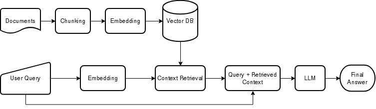
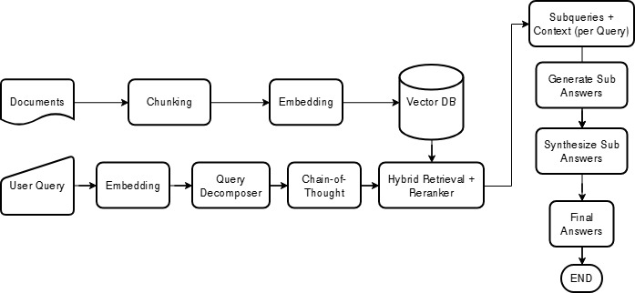
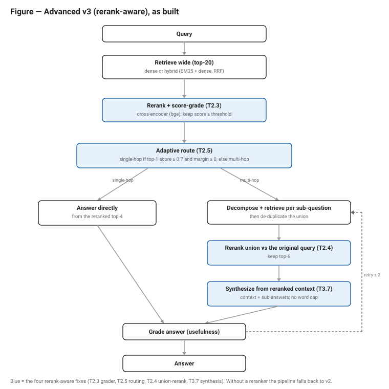
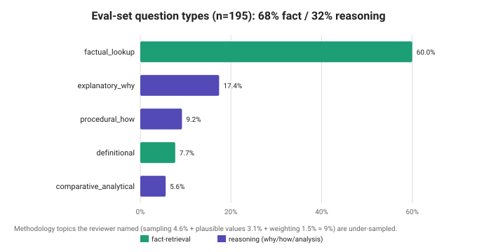
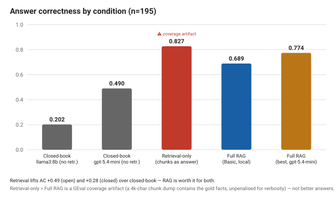
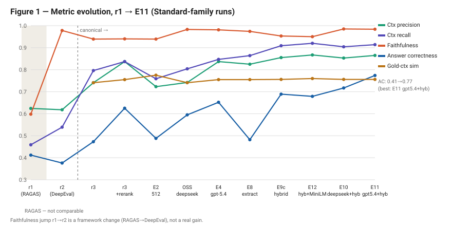
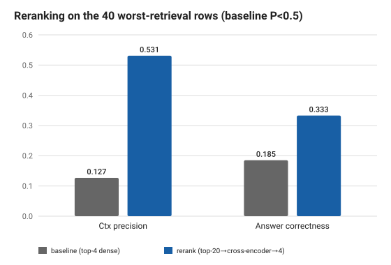

# Information Retrieval Using Retrieval-Augmented Generation on PIRLS Documents

### A Comparative Evaluation of Retrieval and Architecture Choices for Privacy-Preserving, Locally-Hosted Question Answering

**Prepared by:** Widianto Persadha, Heiko Sibberns, Mohammad S. Thariq, Bettina Wietzorek
**Prepared for:** IEA — R&D Committee
**Revised:** June 2026 *(a revision of the original 2026 final report)*

---

## Executive Summary

We developed a proof-of-concept system that answers natural-language questions over IEA's PIRLS 2021 documentation. It uses Retrieval-Augmented Generation (RAG) with open-weight language models that run entirely on local hardware, enabling an organization to apply AI to its own documents without transmitting data to an external server. The prototype satisfies the three requirements identified by our staff survey: data privacy, transparent source attribution, and a web interface.

The principal finding is that retrieval quality, not pipeline complexity, determines answer quality. We conducted a controlled benchmark of 195 question–answer pairs scored by a single LLM judge held constant across every run. The largest gains arose from improving how documents are retrieved rather than from adding a more sophisticated "agentic" reasoning pipeline:

| Lever | Answer correctness | Cost |
|---|---|---|
| Baseline (Basic RAG, local llama3:8b) | 0.473 | — |
| + cross-encoder reranking | 0.625 (+32%) | ~$0 (CPU) |
| + hybrid (BM25 + dense) retrieval | 0.689 (+46% over baseline) | ~$0 (local) |
| + stronger generator (closed gpt-5.4-mini) | 0.774 (best overall) | cloud API |

Retrieval is clearly justified. A central question for any such system is whether it outperforms a general-purpose model used without retrieval. Holding the generator fixed, retrieval increases answer correctness from 0.202 with no retrieval to 0.689, a gain of +0.49; the best configuration reaches 0.774. On this corpus the open 8B model is nearly unusable without retrieval, and even the strongest closed model tested gains substantially once retrieval is added.

The hypothesis that a more advanced pipeline performs better did not hold on local hardware. A more complex pipeline that decomposes the query, grades retrieved documents, and re-retrieves per sub-question did not improve answer quality over the simple pipeline, and it incurred four to five times the latency. Part of the large gap reported in the original report was a measurement artifact in how retrieved context was logged (§7.1); once corrected, the two pipelines were comparable in quality. A purpose-built redesign (Advanced v3) reached parity with the simple pipeline but did not surpass it.

We recommend deploying Basic RAG with hybrid retrieval and reranking, using the local open llama3:8b generator as the private default. That configuration is private, costs essentially nothing to run, scores 0.689 on answer correctness, and returns an answer in roughly 20 seconds. The closed gpt-5.4-mini model can be offered as an optional higher-accuracy tier for non-sensitive queries only. We do not recommend deploying the agentic pipeline in its current form. Appendix A summarizes the changes relative to the original report; the items needing resources beyond this phase, chiefly a calibrated human-expert evaluation and validation on non-public documents, are carried forward as prioritized future work.

**Keywords:** retrieval-augmented generation; local LLMs; document question answering; hybrid retrieval; reranking; PIRLS; evaluation.

---

## 1. Introduction

### 1.1 Problem Statement

IEA's large-scale studies generate extensive documentation: study frameworks, international reports, methodological guidelines, technical reports, and questionnaires. These materials hold valuable information about educational trends and about the methods used to produce them, but their volume and complexity make it difficult for researchers to locate specific facts quickly. Keyword search is slow and imprecise, and much of the knowledge resides in unstructured PDFs that resist conventional querying.

Knowledge workers increasingly rely on AI to locate information more quickly, but general-purpose tools are inadequate in a professional setting. Large language models produce fluent, context-aware answers (Brown et al., 2020), yet they can hallucinate plausible but incorrect answers, they cannot access an organization's internal documents, and most commercial models operate in the cloud, which raises data-privacy concerns for sensitive internal material. What is required is a system that combines the fluency of modern LLMs with strict, local data governance. This project develops a proof-of-concept that runs entirely on local infrastructure and grounds every answer in retrieved source passages, so that each answer can be verified against the documents from which it derives.

### 1.2 Scope

This study uses the 2021 PIRLS dataset for development and evaluation. PIRLS was selected for the complexity and diversity of its content, which spans statistical methodology, dense policy and assessment frameworks, and country-level encyclopedic information. These properties make it representative of the high-value, unstructured documentation IEA produces.

This phase focuses on extracting and retrieving high-density information from PDF documents. Multi-modal and structured sources such as SQL databases, spreadsheets, and HTML, together with high-fidelity table extraction, lie outside its scope; §6.5 explains why tables in particular were deferred. The results are intended both as a benchmark and as the basis for a future production deployment.

### 1.3 Motivations and Research Questions

The original report stated the project's significance as a set of forward claims about what a locally-hosted RAG system would deliver. Those claims are better framed as motivations drawn from the literature together with the questions this study seeks to test. A locally-hosted RAG system could benefit IEA in three ways, and we treat each as a question to answer with evidence rather than a benefit to assert in advance.

The first is retrieval efficiency. RAG can let researchers ask natural-language questions and receive concise, source-grounded answers instead of searching large document collections manually. The research question is whether retrieval materially improves answer quality over an LLM used alone, tested in §6.3.

The second is reliability through grounding. Grounding answers in retrieved passages should reduce hallucination and improve verifiability (Lewis et al., 2020; Gao et al., 2024). The research question is how faithful and how correct the grounded answers actually are, and where they fail, examined in §6.2 and §6.4.

The third is privacy and control. Local deployment keeps all processing on-premises, which supports compliance and internal policy. The research question is whether an open, locally-deployable model can reach acceptable quality without a cloud service, tested in §7.2.3.

Beyond these, the project establishes a foundation for later AI applications at IEA, such as report summarization, research assistance, and AI-assisted data cleaning. Those applications remain prospective and are not evaluated here.

### 1.4 Contributions

This report makes five contributions.

1. The design and implementation of two locally-hosted RAG pipelines, a Basic single-pass system and an Advanced multi-step (agentic) variant, built on a common open-source stack of LangChain, LangGraph, Chroma, and Ollama.
2. A PIRLS 2021 evaluation set that combines human-authored and LLM-generated question–answer pairs, with explicit provenance tagging and a characterization of its cognitive coverage (§4.4).
3. A controlled evaluation, with the judge held constant, across four LLM-graded metrics plus a judge-free retrieval check, reporting end-to-end latency on workstation-class laptop hardware.
4. A systematic improvement study that isolates the levers driving answer quality (reranking, hybrid retrieval, generator choice, and chunking), together with a value-added ablation that quantifies what retrieval and generation each contribute.
5. A stage-level error analysis that explains why the advanced pipeline underperformed, and a production recommendation grounded in the results.

### 1.5 Related Work

RAG couples a parametric language model with a non-parametric document store to improve factuality on knowledge-intensive tasks (Lewis et al., 2020). Surveys of the area find that RAG performance depends as much on retrieval quality and document preprocessing as on the generator itself (Gao et al., 2024), a theme our results corroborate.

A common motivation for "agentic" RAG is that complex questions benefit from being broken into sub-problems (Khot et al., 2022) and from iterative self-reflection (Shinn et al., 2023). Corrective RAG (CRAG) adds a validation step after retrieval that checks whether the retrieved documents are relevant before they are used (Yan et al., 2024), and GraphRAG models a corpus as connected units to support multi-hop retrieval and global summarization (Edge et al., 2024). Selective methods such as Self-RAG extend this further, determining for each query whether retrieval is required at all (Asai et al., 2023). Our Advanced pipeline draws on the first two ideas, decomposition and post-retrieval validation, and §6.4 reports the outcome of having a small local model execute this machinery.

On the retrieval side, the retrieve-then-rerank pattern is standard practice: a wide first-stage retrieval is followed by a cross-encoder that re-scores the candidates and keeps the best few (Nogueira & Cho, 2019). Hybrid retrieval, which fuses sparse BM25 scores (Robertson & Zaragoza, 2009) with dense vector similarity (Karpukhin et al., 2020), often using reciprocal rank fusion (Cormack et al., 2009), raises recall on entity-heavy queries that dense embeddings alone tend to miss. Both techniques prove to be the most effective levers in this study.

Evaluation has moved toward LLM-as-a-judge scoring and component-wise metrics such as context precision, context recall, and faithfulness, which make it possible to diagnose retrieval and generation failures separately and at scale (Zheng et al., 2023; Es et al., 2023). This project uses DeepEval's reference-based contextual metrics and its answer-correctness scoring (Confident AI, 2026).

---

## 2. Background

This section describes the techniques on which the remainder of the report depends. Readers already familiar with retrieval-augmented generation may proceed directly to §3. The evaluation metrics are defined separately, alongside the experimental setup, in §4.3.

### 2.1 Retrieval-Augmented Generation

Without an external source of information, a language model answers from the parameters it acquired during training. For a corpus such as PIRLS, this is inadequate sincethe model may not have encountered the documents during training so a confident answer cannot be verified. Retrieval-Augmented Generation (Lewis et al., 2020) addresses this limitation. Rather than relying on the model's recall, it supplies the relevant source passages to the model at the time of answering, so that the model operates on text that is explicitly available to it and every claim can be traced to a document.

The method operates in two phases. The first is performed once, before any question is posed. Each document is divided into chunks of a few hundred words, and every chunk is processed by an embedding model that converts it into a vector — a sequence of numbers positioned such that passages with similar content occupy nearby regions of a high-dimensional space. These vectors are stored in a vector store (here, Chroma). The second phase occurs at query time. The question is embedded by the same model, and the system compares the question's vector against each chunk's vector using cosine similarity, the cosine of the angle between them:

$$\cos(q, d) = \frac{q \cdot d}{\|q\| \cdot \|d\|}$$

This quantity is 1 when two vectors point in the same direction and 0 when they are unrelated, so a higher value indicates that a chunk is more likely to concern the same subject as the question. The system retains the $k$ highest-scoring chunks, inserts them into the prompt, and instructs the model to answer using only the provided context and to state explicitly when the answer is not present.

In this basic form, the most important parameter is $k$, the number of chunks retrieved. If $k$ is too small, the passage containing the answer may fall just beyond the cutoff, leaving the model without the information it requires. If $k$ is too large, the prompt accumulates loosely related text that obscures the relevant passage and increases the likelihood that a small model produces a fluent but incorrect answer. We set $k = 4$. This single-pass procedure — embedding the query, retrieving the top four chunks, and generating once — constitutes Basic RAG, the baseline against which every subsequent refinement is measured.

### 2.2 Corrective RAG

Basic RAG accepts the retriever's ranking without verification. Whatever chunks occupy the top-$k$ positions are passed to the prompt, and any that are off-topic become noise. Corrective RAG (CRAG; Yan et al., 2024) introduces a verification step between retrieval and generation. Each retrieved chunk is assessed for relevance; those judged irrelevant are removed, and if too little context remains, the system may retrieve again or revert to the original set. The objective is to refine the context before the generator processes it.

The effectiveness of this step depends entirely on the quality of the judge. A reliable judge removes genuine distractors while preserving the answer-bearing chunks. An unreliable judge causes harm, because the step can only remove chunks and cannot recover one that was wrongly discarded. When a chunk containing the answer is removed, recall decreases and no subsequent stage can compensate. §6.4 demonstrates that the lightweight grader incorporated into our first agentic pipeline discards answer-bearing chunks often enough that the correction step lowers answer quality rather than improving it.

### 2.3 Hybrid Retrieval

Dense retrieval, the cosine-similarity search described above, is effective at capturing semantic meaning. A query concerning _"young readers' attitudes toward books"_ will retrieve passages on reading motivation even when those exact words do not appear. However, since dense retrieval matches on meaning rather than word form, it may overlook the single literal term on which a question depends. Country names, study acronyms, and identifiers such as _"PIRLS"_ or a specific benchmark label are not always positioned closely in embedding space, so a question that depends on one of them may return plausible but incorrect passages.

The established remedy is lexical search. BM25 (Robertson & Zaragoza, 2009) scores a chunk according to how frequently the query's terms occur within it, assigning greater weight to rare and discriminating terms than to common ones and discounting chunks that score highly based only by their length:

$$\mathrm{BM25}(q, d) = \sum_{t \in q} \mathrm{IDF}(t) \cdot \frac{f(t,d)\,(k_1 + 1)}{f(t,d) + k_1\,(1 - b + b\,\frac{|d|}{\mathrm{avgdl}})}$$

Here $f(t,d)$ is the frequency of term $t$ in chunk $d$, $IDF(t)$ is higher for rarer terms, $|d|$ is the chunk's length, $avgdl$ is the average chunk length, and $k_1$ and $b$ are small tuning constants. As a result, BM25 can reliably locates the chunk that contains "Germany" or "plausible values," in which dense search is least dependable.

Hybrid retrieval performs both searches and combines their results, so that a chunk is retained if either method ranks it highly. We combine them using reciprocal rank fusion (RRF; Cormack et al., 2009), which disregards the raw scores — since a cosine similarity and a BM25 score are not on a common scale — and uses only the position of each chunk within each list:

$$\mathrm{RRF}(d) = \sum_{r} \frac{1}{c + \mathrm{rank}_r(d)}$$

where $rank_r(d)$ is the chunk's position in retriever $r$'s ranking and $c$ is a small constant that prevents the highest ranks from dominating. A chunk near the top of either the dense or the lexical list is therefore elevated in the combined order. Adding BM25 to the dense retriever in this manner recovers the entity-dependent questions that dense similarity alone tends to miss (Karpukhin et al., 2020).

### 2.4 Cross-Encoder Reranking

The retrievers described above are fast because they process the question and each chunk independently. The embedding model encodes the query once and every chunk once, in advance (computed during indexing, before any question is asked), after which retrieval reduces to a nearest-neighbour lookup over millions of precomputed vectors. This arrangement, termed a bi-encoder, scales readily to a large index. However, encoding the query and the chunks separately carries a limitation. Since the two are never processed together, the similarity score is only an approximation of the chunk's true relevance.

A cross-encoder eliminates this approximation. Rather than encoding the two elements separately, it processes the question and a single candidate chunk jointly, allowing every term of the question to attend to every term of the chunk, and produces a single relevance score informed by both (Nogueira & Cho, 2019). It is considerably more accurate, but far too slow to apply across the entire index for every query.

The combination of the first method's speed and the second's accuracy is achieved by applying them in sequence, which is the approach this report adopts. The fast retriever returns a broad set of candidates — in this case, the top 20 — and the slower but more accurate cross-encoder re-scores only those 20 and retains the best 4 for the generator. The expensive model therefore processes no more than a small number of chunks, so the additional cost is modest, while the chunk that genuinely answers the question is promoted into the few that the generator receives, even when it lay outside the initial top 4. §7.2 measures this effect and demonstrates that it is the single largest source of the quality gains reported here.

---

## 3. Methodology

Standard RAG is vulnerable to retrieval noise, which motivated an Advanced variant that adds query decomposition (Khot et al., 2022), step-wise reasoning (Wei et al., 2022), and post-retrieval validation. As the results demonstrate, the value of this additional machinery depends substantially on the capacity of the local model executing it.

### 3.1 Data Preparation

The knowledge base was constructed from publicly available PIRLS 2021 PDFs: the *International Results in Reading*, the *Encyclopedia* of education policy and curriculum, the *Methods and Procedures* technical report, the *User Guide for the International Database*, *Countries' Reading Achievement*, and the school, teacher, and student questionnaires. Each PDF is loaded with `PyPDFLoader`, split into chunks with a recursive character splitter, embedded with a sentence-transformer model (Reimers & Gurevych, 2019), and stored in a Chroma vector index. Chroma runs in-process with no external service, which keeps the entire pipeline self-contained and offline.

Measured directly from the live index, the knowledge base has the following scale.

**Table 1. Knowledge-base scale (measured from the live index).**

| Property | Value |
|---|---|
| Source documents | 108 |
| Indexed chunks | 6,771 |
| Total tokens (cl100k_base) | ~1.5 million |
| Mean chunk length | 122 words / 812 characters / 221 tokens |
| On-disk footprint | 70.9 MB |
| Embedding model | `sentence-transformers/all-mpnet-base-v2` (768-dim) |

The chunking parameters and the choice of embedding model are examined in §7.2.4, where we show that retrieval quality, not chunk granularity, is the binding constraint.

### 3.2 User Survey

Before development began, we conducted a requirements survey across IEA staff in the Hamburg and Amsterdam offices to confirm that the prototype addressed a genuine need. Forty staff responded, completing Phase 1 of the program. Respondents came from across the specialized units, with the International Study Unit the largest group at 15 respondents, alongside colleagues from Sampling, Data Management, Software, and Research and Analysis. Thirty-three responded in English and seven in German.

The functional requirements were clear. Navigating complex study information was the foremost need, with technical documentation and specific study results such as PIRLS each cited 28 times. Staff also requested cross-region comparisons and longitudinal analysis. Most respondents wanted a "medium" level of detail in answers, though a sizeable segment requested either exhaustive explanations or direct access to the underlying data and tables.

The non-functional requirements shaped the design just as strongly. Speed is a clear requirement: 80% of respondents expected an answer within 30 seconds, and many preferred a few seconds. Accuracy ranks even higher, with over 67% rating precise information "extremely important." In the open-ended responses, staff repeatedly stressed the need for source attribution so that they can verify an answer manually, which reflects an awareness of how confidently such tools can produce incorrect answers. These two themes, accuracy and verifiability, shaped a system that pairs a retriever grounding every answer with an interface that displays the underlying source chunks.

### 3.3 System Architecture

Both pipelines run on a local open-source stack. LangChain handles document loading, splitting, and prompting; LangGraph manages the stateful multi-step workflow used by the Advanced pipeline; Ollama serves the local models, so a model can be swapped without code changes; and Chroma stores the vectors.

#### 3.3.1 Basic Architecture (Basic RAG)

*Figure 1. The Basic RAG pipeline. Documents are chunked, embedded, and stored; a query is embedded, the top-k chunks are retrieved, and the model answers using only the retrieved context.*

The Basic pipeline is a linear retrieve-then-generate path. PDFs are ingested and chunked, the chunks are embedded and stored in Chroma, and at query time the system retrieves the top-$k$ chunks by similarity. Those chunks are injected into a prompt that instructs the model to answer using only the provided context and to indicate when the answer is not present. The model then generates the answer. The original implementation retrieved the top chunks by dense similarity alone; §7.2 replaces that with a wider retrieval followed by reranking and hybrid fusion, which is the source of most of our gains.

#### 3.3.2 Advanced Architecture (Advanced RAG)

*Figure 2. The intended Advanced RAG workflow: decompose the query, plan sub-steps, retrieve, answer each sub-question, and synthesize a final answer.*

The Advanced pipeline runs as a stateful graph rather than a linear path. Its intended design decomposes a complex query into sub-questions, validates the retrieved documents, answers each sub-question, and synthesizes a final answer from those parts.

There is an important correction between what the original report described and what was actually evaluated. The original report described the Advanced pipeline as already performing per-sub-question re-retrieval and reranking. The version that was actually measured, which we now call Advanced v1, did neither. Its sub-questions reused the original query's retrieved documents, and no reranker was integrated into the graph. Its only active post-retrieval step was a binary relevance grader run by a small `gemma3:1b` model. The intended re-retrieval and reranking were built later, in the Advanced v2 and v3 iterations described in §7.3. To preserve the integrity of the analysis, we describe each version by what it actually implemented and attribute results accordingly.

**Advanced v1, as built.** Figure 3 shows the pipeline that was actually evaluated, a five-stage graph. First, it retrieves the top four chunks for the original query. Second, a small `gemma3:1b` model grades each chunk as relevant or not and drops those it rejects; if it rejects all four, the pipeline keeps the original four rather than proceeding with no context. Third, it decomposes the query into two or three sub-questions, but answers each from the same original chunks, with no fresh retrieval. Fourth, it answers the sub-questions and synthesizes a final answer capped at 100 words. Fifth, the same `gemma3:1b` model grades the answer for usefulness, and an answer judged unhelpful is regenerated up to two times. The two steps that distinguish v1 from Basic RAG, the binary grader and the decomposition, are precisely the ones §6.4 finds to be net-negative on this corpus.

*Figure 3. The Advanced v1 (CRAG) pipeline as evaluated. The gemma3:1b grader can only drop chunks, the sub-questions reuse the original query's documents, and there is no reranker and no per-sub-question retrieval.*

**Advanced v2, as built.** Advanced v2 keeps v1's five-stage structure and its `gemma3:1b` grader but changes how the sub-questions are handled. Where v1 answered every sub-question from the original query's four chunks, v2 retrieves a fresh set of chunks for each sub-question, de-duplicates them across sub-questions, and merges them into a single combined context from which the generator writes the final answer; the 100-word synthesis cap used by v1 is also removed. The binary grader, the decomposition step, and the answer-usefulness check are all inherited unchanged from v1. Figure 4 shows the added per-sub-question retrieval and the de-duplicated union.

*Figure 4. Advanced v2 adds per-sub-question retrieval and a de-duplicated union (highlighted) on top of v1. The extra retrieval widens the context with chunks that are relevant to the sub-questions but off-topic for the original query.*

**Advanced v3, as built.** Advanced v3 is a rerank-aware redesign that runs on the improved retriever from §7.2. It changes four things relative to v1. First, it replaces the binary `gemma3:1b` grader with reranker-score thresholding, so chunks are filtered by a graded relevance score rather than a keep-or-drop decision. Second, it decomposes adaptively: a question whose top reranked chunk scores at least 0.7 and clearly outscores the runner-up is treated as single-hop and answered directly, while the rest are decomposed as in v2. Third, for decomposed questions it reranks the combined sub-question chunks against the original query before generating. Fourth, it synthesizes the final answer from that reranked context rather than from the separate sub-answers. If no reranker is available, the pipeline falls back to v2. Figure 5 shows the flow.

*Figure 5. Advanced v3 replaces the binary grader with reranker-score thresholding (T2.3), routes single-hop questions straight to a direct answer and decomposes only genuine multi-hop questions (T2.5), reranks the sub-question union against the original query (T2.4), and synthesizes from the reranked context (T3.7). Without a reranker the pipeline falls back to v2.*

Three Advanced versions appear in this report.

**Table 2. The three Advanced pipeline versions.**

| Version | Additional Features | Status |
|---|---|---|
| Advanced v1 | `gemma3:1b` document grader; decomposition that reuses the original documents; synthesis capped at 100 words | Evaluated; this is the original "advanced" system |
| Advanced v2 | per-sub-question re-retrieval plus chunk de-duplication; no word cap | Evaluated (§7.3) |
| Advanced v3 | reranker-score grader; reranks the sub-question union against the original query; adaptive decomposition; synthesizes from reranked context | Evaluated on the improved retriever (§7.3); matches Basic (0.780 vs 0.774), does not surpass it |

Each version is described above as it was actually built; the reasoning behind each change, and the evaluation results, are reported in §7.3.

---

## 4. Experimental Setup

### 4.1 Hardware

The original prototype was built and tested on an Alienware M18 (Intel Core i9-13980HX, NVIDIA RTX 4090 Laptop GPU 16 GB, 64 GB RAM); we avoided cloud GPUs to keep the system offline and to stress-test it under realistic local constraints. The re-evaluation here, covering the improvement experiments in §6 and §7, ran on a different machine because access to the RTX 4090 laptop was limited at the time. The machine used in the re-evaluation was an Intel Core Ultra 9 (16 cores), 32 GB RAM, and an Intel Arc Pro 140T GPU (16 GB). Consequently, the response-time figures in this revision are not comparable to the latency in the original report. The quality metrics (context precision and recall, faithfulness, and answer correctness) are hardware-independent and unaffected. The deployment implications of running on a single machine are discussed in §8.2.

### 4.2 Models

The choice of models follows from the privacy goal. Since the aim is to keep data on the organization's own hardware, the generator has to be an open-weight model that can run locally. A closed, cloud-hosted model would send every query and every retrieved passage to an external server, which is the situation this project tries to avoid. 

Model size was the next constraint. Early tests with large models such as Llama-2 70B were unusable on local hardware, with single queries taking minutes (one PIRLS question took 139.46 seconds, another 59.2). We therefore standardized on sub-10B open-weight models, which keep response times usable on a single GPU. Llama 3 (8B) is the primary generator, chosen for its quality at that size. The original report had also evaluated Gemma 3 (4B), which scored on par with Llama 3 8B (answer correctness 0.42 against 0.41). This model was not carried forward, since the re-evaluation fixed a single generator and probed strength only at the extremes — a stronger open-source reasoning model, DeepSeek-R1 (8B) (DeepSeek-AI, 2025), and a strong closed model, gpt-5.4-mini. For the controlled three-architecture comparison in §6 the generator is held fixed at llama3:8b so only the pipeline varies. The generator is then varied on its own in §7.2.3, applied to the best retrieval configuration. There, gpt-5.4-mini serves as an open-versus-closed benchmark to measure how much accuracy the privacy constraint costs.

Two of the agentic pipelines use a second, smaller model as an internal grader that scores each retrieved chunk for relevance (§2.2). We use gemma3:1b for that role. The grader only runs once per chunk and it should not add latency. Therefore we use gemma3:1b for that role. However, §6.4 shows that this economy proves a poor trade-off on this corpus.

All quality metrics are scored by a single LLM judge, `gpt-oss-120b`, served through an OpenAI-compatible API. Three considerations drove that choice. It is an open-weight model, so the evaluation is reproducible by anyone and does not depend on a proprietary endpoint that can change or be withdrawn. It is much larger than any system under test, so it grades their outputs from a position of greater capability. And it is held fixed across every run, so a difference in score reflects a difference in the systems rather than drift in the judge. An earlier evaluation pass used a different framework and judge, which is why scores are not comparable across passes; §7.1 covers this.

### 4.3 Metrics

We report four LLM-graded metrics, each probing a different stage of the pipeline, plus one judge-free retrieval check. All scores lie between 0 and 1, and higher is better. The definitions follow DeepEval (Confident AI, 2026).

*Context precision* measures the signal-to-noise ratio of the retrieved chunks: are the relevant chunks ranked above the irrelevant ones? It is the rank-weighted mean of precision-at-k,

$$\text{Context Precision} = \frac{\sum_k P(k)\,\mathrm{rel}(k)}{\text{number of relevant chunks}}$$

where rel(k) is 1 when the chunk at rank k is relevant and P(k) is the precision over the top k. If relevant chunks occupy ranks 1 and 3 with an irrelevant chunk at rank 2, the score falls below 1.0 because an irrelevant chunk outranks a relevant one.

*Context recall* measures whether retrieval captured all the facts the reference answer needs. An LLM breaks the reference answer into individual statements and checks each against the retrieved context,

$$\text{Context Recall} = \frac{\text{reference statements supported by the context}}{\text{total reference statements}}$$

If the reference makes two claims and only one appears in the retrieved chunks, recall is 0.5.

*Faithfulness* is a hallucination detector: it checks that the answer's claims are grounded in the retrieved context. An LLM extracts the atomic claims in the answer and verifies each against the context,

$$\text{Faithfulness} = \frac{\text{answer claims supported by the context}}{\text{total answer claims}}$$

An answer that states one supported fact and one fact absent from the context scores 0.5.

*Answer correctness* compares the generated answer with the reference answer for factual and semantic agreement, independent of wording. It is scored with G-Eval (Y. Liu et al., 2023), in which the judge reasons step by step against a fixed rubric and returns a probability-weighted score. "Germany scored 524" against a reference of "Germany: 524 points" scores near 1.0 despite the different phrasing, whereas a missing or contradicted figure is penalized.

The fifth check, new in this revision, is gold-context similarity: the maximum cosine similarity between the gold reference passage and any retrieved chunk. It is deterministic and needs no judge, which makes it a cheap, repeatable way to ask whether retrieval surfaced the right passage at all, independent of how the judge scored the final answer.

We chose DeepEval over RAGAS after RAGAS proved both far slower and unreliable on a local judge, as §7.1 recounts. For latency, lower is better.

### 4.4 Evaluation Dataset Construction

The evaluation set is the same 195 question–answer pairs the original report scored, now annotated with explicit human/synthetic provenance and held in `datasets/revision/`. These 195 are the items from the original report's 300-item pool that both pipelines could complete; the rest were set aside because the advanced pipeline's outputs exceeded the judge's token limit. We reuse this selection unchanged, both for comparability with the original report and because the full 300-item pool has a train/evaluation leakage problem (§7.2.4) that makes its surplus items unsuitable as held-out data.

Of the 195 pairs, 123 are human-generated, authored by a domain expert, with each answer traceable to the source documents; these anchor the evaluation. The remaining 72 are synthetic, generated with a large model from passages in the corpus to broaden coverage. Because synthetic items may not reflect real user intent, we report results split by provenance throughout §6.2 and §6.3.

#### 4.4.1 Dataset Composition: Provenance and Question Coverage

To characterize what the evaluation set tests, we classified all 195 questions by cognitive level and subtype, using the same `gpt-oss-120b` model (`scripts/classify_questions.py`).

*Figure 6. Distribution of the 195 evaluation questions by subtype (n=195), colored by whether they are fact-retrieval or reasoning questions.*

**Table 3. Question coverage by cognitive level and provenance.**

| Cognitive level | Overall | Human (n=123) | Synthetic (n=72) |
|---|---|---|---|
| Fact-retrieval | 68.2% (133) | 77.2% | 52.8% |
| Reasoning (why/how/analysis) | 31.8% (62) | 22.8% | 47.2% |

The set is dominated by fact-retrieval questions at about 68%, while the deep methodological "why and how" questions are under-sampled: sampling at 4.6%, plausible values and scaling at 3.1%, and weighting and variance at 1.5%, roughly 9% combined. We note this as a limitation in §8 and recommend deliberately over-sampling reasoning-heavy methodological questions in any follow-up evaluation set.

---

## 5. Relation to the Original Report

The original report and this revision are two evaluations of the same family of systems, carried out a few months apart with different evaluation machinery. This section connects them: how the experiment program unfolded, what the original report measured, and why the numbers here differ from the ones it published.

### 5.1 Experimental Progression

The work started from the prototype and the findings in the original report, and it proceeded in a deliberate order that explains the shape of the experiment matrix in Appendix B.

We first corrected the problems in the original evaluation (§7.1 sets them out) and re-ran the Basic pipeline to establish a reliable baseline. We then applied the same corrections to the Advanced pipeline and re-evaluated it, first as Advanced v1 and then, after reworking its sub-question handling, as Advanced v2. Across that corrected comparison the Basic pipeline remained ahead (§6.1), so we concentrated the improvement effort there rather than on the agentic machinery.

That decision is why the middle of the experiment matrix varies only the Basic pipeline. The sequence of retrieval and generator levers — reranking, then hybrid retrieval, then a stronger generator up to gpt-5.4-mini — was explored on Basic alone, because Basic was the configuration worth improving. Only once those levers had been characterized did we incorporate the best of them, hybrid retrieval with a cross-encoder reranker, into the agentic pipeline. That is the last pair of runs, Advanced v3 (rerank-aware, §7.3), whose purpose was narrow: to test whether a strong retrieval stack could be advanced further by the decomposition machinery. The progression runs baseline → corrected Advanced (v1, v2) → a Basic-only improvement search → Advanced v3, and Appendix B reads in that order.

### 5.2 Original Results and Corrections

The original report evaluated the Basic and Advanced pipelines across three local generators; its headline numbers are reproduced in Table 4.

**Table 4. Results as reported in the original report (averaged over the same 195 items; higher is better; latency on the original RTX-4090 hardware, in seconds).**

| Pipeline | Generator | Ctx Precision | Ctx Recall | Faithfulness | Answer Correctness | Latency (s) |
|---|---|---|---|---|---|---|
| Basic | Llama 3 8B | 0.62 | 0.54 | 0.98 | 0.41 | 7.4 |
| Basic | Gemma 3 4B | 0.64 | 0.56 | 0.97 | 0.42 | 5.9 |
| Basic | DeepSeek-R1 8B | 0.63 | 0.54 | 0.97 | 0.44 | 19.0 |
| Advanced | Llama 3 8B | 0.29 | 0.31 | 0.97 | 0.23 | 22.9 |
| Advanced | Gemma 3 4B | 0.31 | 0.29 | 0.96 | 0.24 | 15.4 |
| Advanced | DeepSeek-R1 8B | 0.33 | 0.30 | 0.98 | 0.28 | 82.6 |

Two observations are notable. The original report already found Basic ahead of Advanced on every model, the same conclusion this revision reaches, so the overall direction has not changed. But the absolute numbers differ sharply, and the difference is largest for the Advanced pipeline. The original report reported its context precision as 0.29; for the same pipeline on the same questions, we now measure 0.690 (Table 5).

That gap is a measurement error, not a change in system behavior. The Advanced pipeline retrieved the same chunks as Basic, but logged them in a format that drove the ranking metrics toward zero. Re-scoring the identical retrieval from a correct log restores Advanced's precision and recall to Basic's range, which removes most of the precision gap reported originally. §7.1 details the mechanism.

The logging bug did not affect Basic, yet its scores still changed: context recall rose from 0.54 to 0.80 and precision from 0.62 to 0.74. These gains come from fixing the prototype and hardening the evaluation. The re-evaluation repaired a retrieval defect, fixed the retrieval depth at k = 4, logged the retrieved context as a proper chunk list, and held a single judge constant across all runs. The embedding model was `all-mpnet-base-v2` in both the original prototype and this re-evaluation; the original report's reference to "embeddinggemma" was a labelling error (§7.2.4), not a system change. The result is a Basic baseline whose context precision and recall are measured accurately, so improvements can target specific weaknesses and each change can be validated against a reliable score.

The two evaluations differ in measurement methodology: a repaired retrieval path, chunk-list context logging, and a single judge held constant across runs. The absolute values in Table 4 are therefore not directly comparable to the re-evaluation results reported elsewhere in this report. Only the within-evaluation ordering is comparable, and it is consistent: Basic outperforms Advanced in both.

---

## 6. Results and Discussion

### 6.1 Architecture Comparison

The controlled comparison holds the dataset, judge, embeddings, retrieval, and generator (llama3:8b) constant, and varies only the architecture.

*Figure 7. The final-evaluation comparison of Basic, Advanced v1, and Advanced v2 across four quality metrics (llama3:8b, n=195).*

**Table 5. Basic vs Advanced pipelines (llama3:8b, n=195, `gpt-oss-120b` judge).** Higher is better; latency is lower-is-better.

| Architecture | Ctx Precision | Ctx Recall | Faithfulness | Answer Correctness | Gold-Ctx Sim | Latency (s) |
|---|---|---|---|---|---|---|
| Basic | 0.741 | 0.796 | 0.939 | 0.473 | 0.741 | 19.5 |
| Advanced v1 | 0.690 | 0.671 | 0.948 | 0.474 | 0.717 | 74.1 |
| Advanced v2 | 0.449 | 0.650 | 0.910 | 0.334 | 0.712 | 101.8 |

The Basic pipeline performs best or ties on four of the five quality metrics. Advanced v1 matches Basic on answer correctness (0.474 against 0.473) but loses recall, and Advanced v2 regresses on both precision and answer correctness. Faithfulness stays high everywhere, between about 0.91 and 0.95, so all three pipelines ground their answers well in whatever context they receive. The differences between them lie in how each pipeline selects and uses context, not in raw grounding. Latency rises sharply with complexity, reaching 3.8 times and 5.2 times the Basic pipeline's response time.

### 6.2 Metric-by-Metric Analysis

On context precision and recall, the Basic pipeline retrieves focused, on-topic context, scoring 0.74 on precision and 0.80 on recall. Advanced v1 loses recall, dropping to 0.67, and Advanced v2 loses precision substantially, to 0.45. §6.4 attributes each loss to a specific stage of the pipeline.

Faithfulness is uniformly high, between 0.91 and 0.95, so grounding is not the source of difficulty. When these models are provided with context, they rarely contradict it. This argues against weak reasoning as the primary failure mode, and against fine-tuning as the first lever to consider.

Answer correctness is approximately 0.47 for all three architectures on the base model. §6.4 explains the ceiling, and §7.2 shows how improved retrieval raises it to 0.689 without any change to the model.

On response time, the single-pass Basic pipeline is far faster. The Advanced pipelines run several sequential model calls for grading, per-sub-question generation, and synthesis, so the latency compounds, and it is worst for reasoning models, with DeepSeek-R1 exceeding 80 seconds per query.

*Figure 8. Mean latency per question, in seconds, measured on the re-evaluation laptop (Intel Arc Pro 140T). These are not comparable to the original report's RTX-4090 timings, and the API runs marked with an asterisk use hosted GPUs that are not comparable to the local runs either.*

### 6.3 The Value of Retrieval: An Ablation Study

Two questions about whether the system justifies its complexity merit direct examination. First, does RAG outperform a general-purpose LLM used without retrieval? Second, what does the generator add over simply returning the retrieved chunks? A single ablation answers both, scoring answer correctness across five conditions on the same 195 questions with the same judge.

*Figure 9. Answer correctness by condition (n=195). Retrieval lifts correctness sharply for both the open and the closed generator. The retrieval-only bar is high only as an artifact of how G-Eval scores answer correctness: it rewards coverage of the reference facts and does not penalize a verbose, unsynthesized chunk dump, so a roughly 4,000-character blob that happens to contain the gold facts scores well. It is not a usable answer, and it is not comparable to the RAG bars, which are held to producing a concise, synthesized response.*

**Table 6. Value-added ablation (answer correctness).**

| Condition | What it is | Overall | Human | Synthetic |
|---|---|---|---|---|
| Closed-book (open model) | llama3:8b, no retrieval | 0.202 | 0.150 | 0.290 |
| Closed-book (closed model) | gpt-5.4-mini, no retrieval | 0.490 | 0.377 | 0.683 |
| Retrieval-only | top-4 hybrid chunks as the answer, no LLM | 0.827 | 0.852 | 0.785 |
| Full RAG (Basic, local) | llama3:8b + hybrid retrieval | 0.689 | 0.753 | 0.581 |
| Full RAG (best) | gpt-5.4-mini + hybrid retrieval | 0.774 | 0.787 | 0.751 |

Retrieval helps both the open and the closed generator. Holding the generator fixed, retrieval lifts answer correctness from 0.202 to 0.689 for the local open model, a gain of +0.49, and from 0.490 to 0.774 for the strong closed model, a gain of +0.28. Retrieval adds substantial accuracy even to the closed model that scores best without it. On this corpus the deployable open 8B model is nearly unusable without retrieval, which provides the empirical justification the design requires. The result is also consistent with the often-cited NAEP finding (Wei, 2024) that a much larger closed model (GPT-4o) scored well without retrieval: the two observations are consistent once model scale is accounted for, since our own closed-book closed model is far stronger than the open one (0.490 against 0.202) yet still gains +0.28 from retrieval here. For the open model this project targets, retrieval is essential; even for the strongest closed model, it remains clearly beneficial.

The generation result needs a careful reading. At face value the retrieval-only condition scores 0.827, above full RAG, which would suggest the generator has negative value. This is not true. The number is a scoring artifact (Figure 9): the retrieval-only "answer" is a roughly 4,000-character dump of the top chunks, and the answer-correctness metric rewards how many reference facts are present without penalizing length. A long dump that contains the gold facts scores well, while the generator's short synthesis loses points whenever it leaves out a fact to stay concise. A 4,000-character dump is not a usable answer, so the two conditions are not comparable. This fits the rest of the report: the system is limited by retrieval, not by generation. Once the right chunks are retrieved the facts are there, and the generator turns them into a short, attributable answer. Experts in the domain may do fine with the raw chunks, however non-experts need the synthesis. Measuring what the generator adds would require a concision or usability metric, not fact coverage alone (§8.3).

### 6.4 Locating the Performance Bottlenecks

It is important to identify which stage of the advanced pipeline fails — decomposition, retrieval, reranking, or synthesis — rather than relying on competing explanations. The data localizes each loss to a specific, measured mechanism, and the conclusion is that the problem lies in retrieval and orchestration rather than in the small model's reasoning, since faithfulness is high everywhere.

The first loss is in Advanced v1, where the grader degrades recall. Its `gemma3:1b` document grader activates on 87 of the 195 questions. Where it drops chunks, recall collapses to 0.486, against 0.819 when it keeps all four, and precision falls as well. A weak 1B model removes answer-bearing chunks and retains inferior ones, making it a net-negative filter.

*Figure 10. Context recall in Advanced v1, split by whether the gemma3:1b grader dropped chunks. Where the grader fires, recall collapses from 0.819 to 0.486.*

The second loss is in Advanced v2, where per-sub-question retrieval degrades precision. Decomposing roughly 73% of the questions and then retrieving fresh chunks for each sub-question widens the context, from a mean of 4.0 chunks to 5.9, with material that is relevant to the sub-questions but off-topic for the original question against which precision is scored. That more than doubles the retrieval-failure rate: 107 of 195 rows fall below 0.5 precision, against 40 for Basic.

The third factor is a shared generation ceiling. Even with good context, where precision is 0.7 or higher, llama3:8b produces a wrong answer on about 21% of rows. This is independent of architecture, and it caps answer correctness near 0.47 for all three pipelines. Improved retrieval (§7.2) recovers many of these rows by surfacing the exact gold chunk, and a stronger generator (§7.2.3) addresses the remainder.

Part of the precision and recall gap reported in the original report was also the logging artifact corrected in this revision and explained in §7.1. The practical implication is to invest in retrieval and orchestration, which §7.2 pursues and where the largest gains are found.

### 6.5 Tabular Data Extraction

The system could not reliably extract information from tables with nested layouts or graphical elements. Standard PDF text extraction flattens table structure and loses the row-and-column relationships, so a figure that is obvious to a human reader becomes an unstructured sequence of numbers to the retriever. Treating tables as images for a vision-language model such as LLaVA (H. Liu et al., 2023) also performed poorly: fragments parsed, but headers and categories were misassociated, and a text embedding model is not built for spatial layout in any case. Given the engineering effort a proper fix would require, we deferred high-fidelity table extraction; §8.3 lists the specialized parsers we would evaluate next.

### 6.6 The Deployed User Interface

*Figure 11. The IEA–PIRLS Document Search interface. The left sidebar offers a model-type toggle (open, local and private, versus closed, cloud API), a local Ollama model selector, a high-accuracy hybrid-plus-reranker retrieval switch, and a document-upload panel. The main pane shows the generated answer with its provenance metadata (model, retrieval mode, response time, and chunk count), a collapsible "Sources used" inspector, and a "Recent questions" history panel.*

*Figure 12. The expandable source-chunk inspector, showing the exact retrieved passages behind an answer. This directly addresses the survey's demand for verifiable, attributable answers, and each chunk can be traced back to its source document and page.*

We developed a Streamlit web interface that allows staff to query the PIRLS corpus and view both the answer and the underlying source chunks. It provides the controls between the local, privacy-preserving model (llama3:8b via Ollama) and an optional cloud API, a toggle for hybrid-plus-reranker retrieval, and a document-upload panel for ad-hoc corpora. Every answer carries provenance metadata — model, retrieval mode, response time, chunk count — alongside an expandable panel showing the exact source passages. A query such as "What is PIRLS?" returns an answer in about 17 seconds on the local model, with its four source chunks one click away. Grounded answers together with visible sources make the system auditable and suitable for institutional use.

To make this concrete, the example below is one question from the evaluation set answered by the recommended configuration (Basic RAG with hybrid retrieval and bge reranking, local llama3:8b), reproduced verbatim from the run.

**Question.** _How are achievement items arranged in PIRLS 2021 assessments, and how are they linked for reporting proficiency?_

**Answer (llama3:8b).** _Achievement items in PIRLS 2021 assessments are arranged in blocks that are then assembled into student booklets containing different (but systematically overlapping) sets of item blocks. Statistical and psychometric methods are required to link these different booklets together so that student proficiency can be reported._

**Top source chunk (one of the four shown to the user).** _"…these achievement items are arranged in blocks that are then assembled into student booklets containing different (but systematically overlapping) sets of item blocks…" — from the *Methods and Procedures* technical report (citing the PIRLS 2021 Assessment Design; Martin et al., 2019)._

**Retrieval and timing.** Four chunks retrieved; answered in about 24 seconds on the re-evaluation laptop. The judge scored the answer 1.00 on answer correctness and 1.00 on faithfulness, and every claim is traceable to the source chunk it came from. This is a methodological "how" question, the harder and under-sampled category (§4.4.1), yet the answer is concise and fully grounded in the retrieved source.

---

## 7. System Improvements

### 7.1 Evaluation Hardening

The benchmark proceeded through three passes. Only the final pass supports valid comparison, and the progression explains the discrepancy with the original report's figures.

The first pass used RAGAS and was abandoned partway through, after the harness hit a cascade of API-quota errors, local-judge timeouts, and library-version failures and never produced complete scores for the Advanced pipeline. In response we pinned the evaluation stack and made scoring resilient to single-row failures.

The second pass moved to DeepEval and exposed a measurement artifact. The Advanced pipeline's retrieved context had been logged as a single concatenated blob rather than a list of separate chunks. Context precision and recall are ranking metrics computed over a list, so a single blob drives them toward zero. That is what inflated the precision and recall gap in the original report. The cause is logging, not retrieval: the Advanced pipeline uses the same retriever and query as Basic and retrieves the same chunks, so the lower score reflects only how that text was recorded.

This report relies on the third pass, which logs every system's context as a chunk list, fixes the retrieval bug, and holds the judge constant. It is the first trustworthy three-way comparison. Scores are comparable only within a pass, because the harness, embeddings, and judge all changed between passes. Faithfulness, for instance, rises between the first two passes, but that reflects the change of framework, not a real improvement.

*Figure 13. Metric evolution across the evaluation passes and experiments for the Basic-family runs. The shaded RAGAS region is not comparable; the trustworthy comparison begins at the final pass.*

### 7.2 Improvement Levers

A retrieval-only diagnostic demonstrates why retrieval is the most important lever. The gold-bearing chunk is in the top 4 only 63% of the time, but it is in the top 20 fully 87% of the time. The remedy is to retrieve broadly and then rerank, promoting the gold chunk into the few that the generator receives.

#### 7.2.1 Reranking

Retrieving the top 20 candidates and re-scoring them with a  cross-encoder to keep the best 4 increases answer correctness from 0.473 to 0.625, a 32% gain. Precision rises from 0.741 to 0.837 and recall from 0.796 to 0.837. The gain concentrates on the 40 worst-retrieval rows, where mean precision rises from 0.127 to 0.531 and answer correctness from 0.185 to 0.333.

*Figure 14. The effect of reranking on the 40 worst-retrieval rows: mean precision and answer correctness both rise substantially, which is where the overall gain comes from.*

#### 7.2.2 Hybrid Retrieval

Adding sparse BM25 retrieval, fused with the dense retriever through reciprocal rank fusion and then reranked, increases answer correctness further, from 0.625 to 0.689, and raises recall to 0.909, the highest of any run. Lexical BM25 captures exact terms, such as country names and program acronyms, that the dense encoder misses. This is the best open and local configuration, at 0.689, and it runs on the free local model. It exceeds even a closed model using plain reranking, which scores 0.652 — direct evidence that retrieval, not generator size, is the dominant lever.

#### 7.2.3 Generator Strength: Open vs Closed

With the best retrieval held fixed, varying the generator constitutes a genuine, additive second lever.

**Table 7. Generator comparison on the best retrieval configuration.**

| Generator | Answer correctness | Latency | Notes |
|---|---|---|---|
| llama3:8b (open, local) | 0.689 | ~20 s | recommended private default |
| deepseek-r1:8b (open, local) | 0.717 | ~62 s | dominated: small gain, 3x latency |
| gpt-5.4-mini (closed, cloud) | 0.774 | ~8 s | optional accuracy tier, non-sensitive only |

The closed gpt-5.4-mini is both the most accurate and the fastest, but it runs in the cloud and so forfeits the privacy guarantee. We present it for two reasons: it is the open-versus-closed benchmark introduced in §4.2, and it is an optional tier for non-sensitive, accuracy-critical queries. It is not the recommended private deployment; that remains the local open model. Retrieval still dominates even at the open tier: the local model with hybrid retrieval (0.689) outperforms the closed model on plain reranking (0.652), and the closed model surpasses it only once it also uses hybrid retrieval.

#### 7.2.4 Chunking, Embedding, and Data Leakage

Three further levers proved minor. Chunk granularity is not the binding constraint: re-indexing at 512/64 instead of 1000/100 barely changed answer correctness (0.473 to 0.488). The embedding model is `sentence-transformers/all-mpnet-base-v2`; the original report's "embeddinggemma" label was an error, and because hybrid retrieval (§7.2.2) already covers a dense encoder's exact-term weakness, swapping it is a low priority. Finally, the original 300-item pool fully contains the 195 evaluation items, so the evaluation set is used unchanged throughout and fine-tuning is not a near-term lever. Appendix B gives the chunking, embedding, and data-leakage specifics.

### 7.3 Revising the Advanced Architecture

Advanced v3 targets the two failures diagnosed in §6.4: v1's grader, which drops answer-bearing chunks and collapses recall, and v2's per-sub-question retrieval, which adds off-topic chunks and collapses precision. The problem is not decomposition itself but how these two versions implement it.

Building on the best retriever from §7.2, Advanced v3 (Figure 5) applies four fixes, each aimed at one of those measured failures:

1. Reranker-score thresholding replaces v1's binary grader, fixing the recall collapse.
2. Reranking the per-sub-question union against the original query fixes v2's precision collapse.
3. Adaptive decomposition routes single-hop questions straight to a direct answer and decomposes only genuine multi-hop ones.
4. Synthesis draws from the reranked context rather than the separate sub-answers, so facts are not lost across steps.

The results, on the same 195 questions with the hybrid-plus-bge reranker and a mean latency of about 9.9 seconds per query, are below.

**Table 8. Advanced v3 results (n=195, hybrid + bge reranker).**

| Generator | Ctx Precision | Ctx Recall | Faithfulness | Answer Correctness |
|---|---|---|---|---|
| llama3:8b (open, local) | — | — | — | not completed* |
| gpt-5.4-mini (closed) | 0.855 | 0.897 | 0.980 | 0.780 |

*The local-generator variant generated all 195 answers, but only 15 of 195 were scored before the evaluation window closed, owing to judge-budget contention with the closed-generator run. The partial sample is all-synthetic and not representative, so we report only the completed closed-generator run.

With the strong closed generator model, Advanced v3 reaches an answer correctness of 0.780. That is effectively identical to the Basic pipeline on the same generator and retriever, which scores 0.774 (§7.2.3); the 0.006 gap is well within run-to-run variation. Advanced v3 also comes at higher latency, about 9.9 against 7.9 seconds per query, and materially more engineering complexity. The four fixes achieved precisely what §6.4 predicted which is closing the recall and precision gap between v1's grader and v2's per-sub-question retrieval raised the agentic pipeline from a net-negative architecture to parity with Basic. Hoever, they did not surpass it. The interpretation is consistent with the rest of the report. Once retrieval is fixed with hybrid fusion and reranking, the system is generation-bound, Additionaly, the agentic orchestration adds cost without adding accuracy on this corpus. We therefore continue to recommend Basic RAG for deployment. The full experiment matrix is in Appendix B.

---

## 8. Recommendations and Future Work

### 8.1 Recommended Deployment

We recommend deploying Basic RAG with hybrid (BM25 plus dense) retrieval and cross-encoder reranking, using the local open llama3:8b generator as the private default. That configuration scores 0.689 on answer correctness and returns an answer in roughly 20 seconds on the re-evaluation laptop, within the 30-second threshold that 80% of staff stated they would accept. Latency will differ on production hardware.

*Figure 15. The recommended production pipeline: a single-pass (Basic) RAG pipeline with hybrid retrieval (BM25 + dense, fused by reciprocal rank fusion) and cross-encoder reranking, generating with a local llama3:8b model. The two highlighted retrieval stages supply the accuracy gains over dense-only retrieval (§7.2).*

Figure 15 shows the pipeline. Each query runs through two retrievers in parallel: BM25 for exact terms such as country names and study acronyms, and a dense embedding model for sematic meaning. Their results are merged by reciprocal rank fusion into a 20-chunk candidate set, and a cross-encoder reranker re-scores those candidates to keep the best four. The four chunks are passed to a local llama3:8b generator, which returns the answer together with the source chunks behind it. The pipeline stays single-pass — no query decomposition and no document grading — so it keeps the Basic pipeline's low latency, while the two retrieval stages supply the accuracy gains documented in §7.2. Every stage runs on local hardware, so no query or document leaves the premises.

As §7.3 concluded, the agentic pipeline is not recommended for deployment. The closed gpt-5.4-mini model should be offered only as an optional higher-accuracy tier for non-sensitive queries.

### 8.2 Deployment Model

The prototype ran on a single laptop, which determines the latency figures in this report. For organizational use we recommend a local network server rather than per-user installations. A single on-premises GPU server would host the model and the vector index and serve the existing web interface to staff browsers. That keeps data on-premises, centralizes index updates and it could host a larger local model than a laptop can, which would help address the sub-10B accuracy ceiling. The cloud closed-model tier from §7.2.3 is reserved for non-sensitive queries.

### 8.3 Future Work

These findings point to several next steps.

The most important is human-expert evaluation. Subject-matter experts should grade a representative subset, both to calibrate the LLM judge and to test whether a given score is good enough for professional use. One observation lessens the concern in the meantime: the best configuration scores 0.774 on answer correctness and 0.865 on precision, both well clear of the 0.5 adequacy mark. A formal expert study remains the right next step.

The evaluation set also needs more reasoning-heavy questions. It is currently about 68% fact-retrieval and under-samples methodological "why and how" questions (§4.4.1). A follow-up evaluation set should include more questions on sampling design, weighting, and plausible values.

Retrieval can likely be improved further. Contextual retrieval (Anthropic, 2024) prepends a short LLM-generated summary to each chunk before embedding, so the chunk keeps the document context that plain chunking removes. Anthropic reports that this cuts retrieval failures substantially. It applies on top of the recommended hybrid-plus-rerank stack and costs only a one-time indexing pass with the local model.

Three engineering directions would also help:

- A concision or usability metric, because the current fact-coverage metric rewards a raw chunk dump as highly as a concise answer and cannot credit what the generator adds (§6.3).
- High-fidelity table extraction, using specialized parsers (Docling, Auer et al., 2024; Marker; PaddleOCR's PP-StructureV2, Li et al., 2022) or vision-based RAG that retrieves over page images and skips text extraction entirely (ColPali, Faysse et al., 2024; VisRAG, Yu et al., 2025), for the table problem (§6.5).
- Latency optimization through quantization (AWQ; Lin et al., 2024), efficient serving (vLLM; Kwon et al., 2023), and prefix caching (SGLang; Zheng et al., 2024), to push the local tier below 10 seconds and make room for larger models on a server.

### 8.4 Limitations

The results are bounded in several ways. Three bound how far they generalize and directly motivate the future work above (§8.3): the corpus is single-domain and public (PIRLS), the LLM judge is not yet calibrated against human experts, and the question set is weighted toward fact-retrieval. Three further caveats concern the measurements themselves. PDF-to-text preprocessing introduces artifacts, most visibly in tables (§6.5). We did not run formal significance tests, so small differences in answer correctness (a few hundredths of a point) should be read as run-to-run variation rather than real gaps. And latency is hardware-specific: the re-evaluation ran on a less capable laptop (Intel Arc Pro 140T, 32 GB) than the original RTX-4090 prototype, so response times are not comparable across the two reports and are used only for relative comparison within the re-evaluation runs.

---

## 9. Conclusion

A locally-hosted RAG system over PIRLS documentation is feasible on local hardware, and it meets the three requirements the staff survey identified: privacy through on-premises deployment, source-attributed answers, and a usable web interface. The central finding, supported throughout, is that retrieval quality rather than pipeline complexity determines answer quality. Cross-encoder reranking and hybrid retrieval together raised answer correctness from 0.47 to 0.69 on the free local model, and a value-added ablation confirms that retrieval accounts for most of the system's usefulness. The more complex agentic pipeline did not outperform the simple one: even a purpose-built rerank-aware redesign (Advanced v3), which repaired the failures that had made the earlier versions net-negative, only reached parity with Basic on the same generator (0.780 against 0.774), at higher latency and greater complexity.

The path forward is therefore clear. We recommend deploying Basic RAG with hybrid retrieval and a local open generator as the private default, offering the closed gpt-5.4-mini model only as a higher-accuracy tier for non-sensitive queries. Two tasks remain beyond this phase: a calibrated human-expert evaluation to confirm the scores are sufficient for professional use, and validation on internal, non-public documents to demonstrate the privacy premise on the material it is meant to protect. With those in place, the prototype can move from proof of concept to a production, privacy-preserving knowledge-management tool for IEA.

---

## 10. References

Anthropic. (2024). *Introducing contextual retrieval.* https://www.anthropic.com/news/contextual-retrieval

Asai, A., Wu, Z., Wang, Y., Sil, A., & Hajishirzi, H. (2023). *Self-RAG: Learning to retrieve, generate, and critique through self-reflection.* arXiv:2310.11511.

Auer, C., et al. (2024). *Docling technical report.* arXiv:2408.09869.

Brown, T. B., et al. (2020). *Language models are few-shot learners.* NeurIPS. arXiv:2005.14165.

Confident AI. (2026). *DeepEval: The LLM evaluation framework.* https://deepeval.com/docs/

Cormack, G. V., Clarke, C. L. A., & Büttcher, S. (2009). *Reciprocal rank fusion outperforms Condorcet and individual rank learning methods.* SIGIR.

DeepSeek-AI. (2025). *DeepSeek-R1: Incentivizing reasoning capability in LLMs via reinforcement learning.* arXiv:2501.12948.

Edge, D., et al. (2024). *From local to global: A GraphRAG approach to query-focused summarization.* arXiv:2404.16130.

Es, S., James, J., Espinosa-Anke, L., & Schockaert, S. (2023). *RAGAS: Automated evaluation of retrieval augmented generation.* arXiv:2309.15217.

Faysse, M., Sibille, H., Wu, T., Omrani, B., Viaud, G., Hudelot, C., & Colombo, P. (2024). *ColPali: Efficient document retrieval with vision language models.* arXiv:2407.01449.

Gao, L., et al. (2024). *Retrieval-augmented generation for large language models: A survey.* arXiv:2312.10997.

Karpukhin, V., et al. (2020). *Dense passage retrieval for open-domain question answering.* EMNLP. arXiv:2004.04906.

Khot, T., et al. (2022). *Decomposed prompting: A modular approach for solving complex tasks.* arXiv:2210.02406.

Kwon, W., et al. (2023). *Efficient memory management for large language model serving with PagedAttention.* SOSP. arXiv:2309.06180.

Lewis, P., et al. (2020). *Retrieval-augmented generation for knowledge-intensive NLP tasks.* NeurIPS. arXiv:2005.11401.

Li, C., et al. (2022). *PP-StructureV2: A stronger document analysis system.* arXiv:2210.05391.

Lin, J., et al. (2024). *AWQ: Activation-aware weight quantization for LLM compression and acceleration.* MLSys. arXiv:2306.00978.

Liu, H., Li, C., Wu, Q., & Lee, Y. J. (2023). *Visual instruction tuning.* NeurIPS. arXiv:2304.08485.

Liu, Y., Iter, D., Xu, Y., Wang, S., Xu, R., & Zhu, C. (2023). *G-Eval: NLG evaluation using GPT-4 with better human alignment.* EMNLP. arXiv:2303.16634.

Nogueira, R., & Cho, K. (2019). *Passage re-ranking with BERT.* arXiv:1901.04085.

Reimers, N., & Gurevych, I. (2019). *Sentence-BERT: Sentence embeddings using Siamese BERT-networks.* EMNLP. arXiv:1908.10084.

Robertson, S., & Zaragoza, H. (2009). *The probabilistic relevance framework: BM25 and beyond.* Foundations and Trends in Information Retrieval.

Shinn, N., et al. (2023). *Reflexion: Language agents with verbal reinforcement learning.* arXiv:2303.11366.

Wei, J., et al. (2022). *Chain-of-thought prompting elicits reasoning in large language models.* NeurIPS. arXiv:2201.11903.

Wei, X. (2024). *Evaluating chatGPT-4 and chatGPT-4o: performance insights from NAEP mathematics problem solving.* Frontiers in Education, 9, 1452570. https://doi.org/10.3389/feduc.2024.1452570

Yan, S. Q., et al. (2024). *Corrective retrieval augmented generation.* arXiv:2401.15884.

Yu, S., et al. (2025). *VisRAG: Vision-based retrieval-augmented generation on multi-modality documents.* ICLR. arXiv:2410.10594.

Zheng, L., et al. (2023). *Judging LLM-as-a-judge with MT-bench and Chatbot Arena.* arXiv:2306.05685.

Zheng, L., et al. (2024). *SGLang: Efficient execution of structured language model programs.* arXiv:2312.07104.

---

## Appendix A — Changes from the Original Report

This appendix summarizes how the present report differs from the original. Each change is classified as **added evidence** (a new experiment or analysis), an **editorial** revision, or an item **deferred** to future work (§8.3).

| Change | Type | Section |
|---|---|---|
| Reframed the significance statements as motivations and explicit research questions | Editorial | §1.3 |
| Corrected the Basic and Advanced architecture descriptions to match what was actually evaluated | Editorial | §3.3.2 |
| Added knowledge-base scale figures and a chunking-sensitivity analysis | Added evidence | §3.1, §7.2.4 |
| Corrected the embedding-model description to `all-mpnet-base-v2` | Correction | §3.1, §7.2.4 |
| Documented the rationale for the generator, grader, and judge choices, and for DeepEval over RAGAS | Editorial | §4.2, §4.3 |
| Classified the evaluation questions by cognitive level and flagged the under-sampling of reasoning questions | Added evidence; editorial | §4.4.1, §8.4 |
| Reported every metric split by human and synthetic provenance | Added evidence | §4.4.1, §6.2–6.3 |
| Clarified the 300-to-195 item selection and reused the same 195 items for comparability | Editorial | §4.4 |
| Added a with-versus-without-retrieval baseline (value-added ablation) | Added evidence | §6.3 |
| Added a retrieval-only baseline isolating what the generator contributes | Added evidence | §6.3 |
| Added an open-versus-closed generator comparison and related it to the NAEP no-retrieval finding | Added evidence; editorial | §7.2.3, §6.3 |
| Added a stage-level attribution of where the advanced pipeline loses quality | Added evidence | §6.4 |
| Hardened the evaluation: chunk-list logging, fixed embedding and retrieval, and a single held-constant judge | Added evidence | §7.1 |
| Added a deployment-model discussion (local network server versus per-user installs) | Editorial | §8.2 |
| Deferred calibrated human-expert evaluation, validation on internal documents, and full judge-sufficiency calibration | Future work | §8.3 |

---

## Appendix B — Full Experiment Matrix

All runs are n=195, judged by `gpt-oss-120b`. The best open/local configuration and the best overall configuration are in bold.

| Run | Generator | Configuration | Ctx P | Ctx R | Faith | Answer Corr | Latency |
|---|---|---|---|---|---|---|---|
| Basic (baseline) | llama3:8b | k=4, 1000/100 | 0.741 | 0.796 | 0.939 | 0.473 | 19.5 s |
| Advanced v1 | llama3:8b | gemma3:1b grader | 0.690 | 0.671 | 0.948 | 0.474 | 74.1 s |
| Advanced v2 | llama3:8b | per-sub-q retrieve + dedup | 0.449 | 0.650 | 0.910 | 0.334 | 101.8 s |
| Basic + rerank | llama3:8b | k=20→rerank→4 | 0.837 | 0.837 | 0.940 | 0.625 | 21.9 s |
| chunk-512 | llama3:8b | k=4, 512/64 | 0.723 | 0.759 | 0.939 | 0.488 | 11.3 s |
| Basic, deepseek | deepseek-r1:8b | k=4, 1000/100 | 0.742 | 0.804 | 0.983 | 0.595 | 62.7 s |
| Basic + rerank, gpt-5.4 | gpt-5.4-mini | k=20→rerank→4 | 0.837 | 0.847 | 0.981 | 0.652 | 1.6 s* |
| rerank + extract prompt | llama3:8b | extract style | 0.825 | 0.864 | 0.974 | 0.482 | 19.4 s |
| dense + bge reranker | llama3:8b | k=20→bge-base→4 | 0.807 | 0.850 | 0.957 | 0.578 | ~22 s |
| **hybrid + bge (best local)** | **llama3:8b** | **BM25+dense→RRF→bge→4** | **0.855** | **0.909** | 0.953 | **0.689** | ~23 s |
| hybrid + MiniLM | llama3:8b | BM25+dense→RRF→MiniLM→4 | 0.867 | 0.920 | 0.950 | 0.679 | 19.2 s |
| hybrid + bge, deepseek | deepseek-r1:8b | BM25+dense→RRF→bge→4 | 0.853 | 0.904 | 0.985 | 0.717 | 62.4 s |
| **hybrid + bge, gpt-5.4 (best overall)** | **gpt-5.4-mini** | **BM25+dense→RRF→bge→4** | **0.865** | **0.914** | **0.984** | **0.774** | 7.9 s* |
| Advanced v3 (rerank-aware) | llama3:8b | hybrid + 4 fixes | — | — | — | n/c† | — |
| Advanced v3 (rerank-aware) | gpt-5.4-mini | hybrid + 4 fixes | 0.855 | 0.897 | 0.980 | 0.780 | 9.9 s* |

*API runs use hosted GPUs, which are not comparable hardware to the local runs.
†The local-generator Advanced v3 generated all 195 answers, but only 15 of 195 were scored before the evaluation window closed (judge-budget contention); not reported. See §7.3.

**Configuration notes.** A few of the runs above warrant explanation.

- *chunk-512* re-indexes the corpus at a 512/64 chunk size and overlap (against the default 1000/100) to test whether smaller, tighter chunks raise retrieval precision. The effect was marginal (answer correctness 0.473 to 0.488, with precision and recall slightly lower), confirming that chunk granularity is not the binding constraint. Index chunks average 812 characters around a gold span of roughly 363 characters, so smaller chunks are marginally cleaner but do not substitute for better retrieval; a full grid search remains a refinement rather than a priority.
- *rerank + extract prompt* keeps the wide-retrieve-then-rerank retriever but switches the generation prompt to an extract-style instruction (pull the exact fact rather than write prose), to test whether prompt style lifts answer correctness. It did not (0.482), which located the reranking gain in retrieval rather than in the prompt.
- *dense + bge reranker* reranks a dense-only candidate set with the bge-base cross-encoder instead of the lighter MiniLM. On dense-only retrieval bge trailed MiniLM (0.578), but under hybrid retrieval it performed better, which is why bge is the production reranker.

**Embedding model.** Both the original prototype and this re-evaluation use `sentence-transformers/all-mpnet-base-v2`, a 768-dimensional general-purpose sentence encoder from Hugging Face. The original report's "embeddinggemma" label was an error. Because the hybrid BM25-plus-dense retriever (§7.2.2) already covers a single dense encoder's main weakness, exact-term matching, swapping the embedding model is a lower-priority lever than reranking and hybrid retrieval.

**Data leakage.** The original 300-item pool fully contains the 195 evaluation items, leaving only about 105 genuinely separate rows — too few to fine-tune on without leakage. This is a further reason the evaluation set is used unchanged throughout, and why fine-tuning is not a near-term lever.

**Value-added ablation (answer correctness, no-retrieval baselines; see §6.3).**

| Run | Generator | Configuration | Answer Corr |
|---|---|---|---|
| Closed-book | llama3:8b | no retrieval | 0.202 |
| Closed-book | gpt-5.4-mini | no retrieval | 0.490 |
| Retrieval-only | — | top-4 hybrid chunks as answer | 0.827 |

---

## Appendix C — Evaluation Results

The complete evaluation results are provided as an accompanying spreadsheet, `revised_final_report_appendix_C.xlsx`. It has a Summary sheet with one row per run — generator, configuration, the five metrics, the human/synthetic answer-correctness split, and latency — and a per-run detail sheet giving the per-question scores behind each run. The underlying per-row CSVs are in the repository's `results/` directory. The generated answers and retrieved contexts behind these scores are provided separately in Appendix D.

**Reproducibility.** The benchmark used the following components. Generators: `llama3:8b` (primary, local via Ollama), `deepseek-r1:8b` (local), and `gpt-5.4-mini` (closed, cloud); the agentic pipelines use `gemma3:1b` as the internal grader. Retrieval: `sentence-transformers/all-mpnet-base-v2` embeddings (768-dim) in a Chroma index, BM25 for sparse retrieval, reciprocal rank fusion, and a `bge-base` cross-encoder reranker. All quality metrics were scored by a single held-constant judge, `gpt-oss-120b`, through an OpenAI-compatible API, using DeepEval's reference-based contextual metrics and G-Eval answer correctness. The pipelines are built on LangChain, LangGraph, Chroma, and Ollama. The evaluation set is the 195-item revised dataset in `datasets/revision/`. The harness, dataset, and per-row results are held in the internal IEA project repository and are available to IEA staff on request, subject to data-governance approval.

---

## Appendix D — Generated Answers and Retrieved Contexts

The per-question generated answers and the chunks retrieved for every run are provided as an accompanying spreadsheet, `revised_final_report_appendix_D.xlsx` — the qualitative companion to Appendix C, cross-referenced by (run, row_id). It contains an "All runs" sheet with one row per question per run (filterable by run and row_id, for comparing how different pipelines answered the same question) and one sheet per run, in the same order and with the same names as Appendix C's detail sheets. Each row gives the question, the gold reference answer and passage, the generated answer, and the retrieved chunks shown to the generator, together with the chunk count and latency. Two run types are special: closed-book runs use no retrieval, so their retrieved-context column reads "— (no retrieval)"; and the retrieval-only run returns the raw top-k chunks directly as the answer, with no generation step (§6.3).
